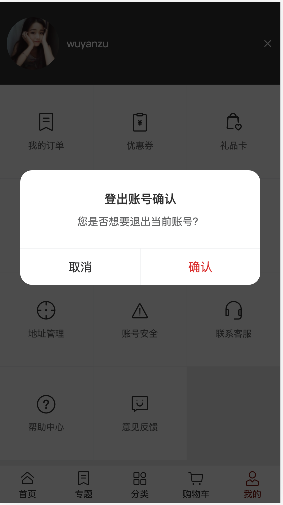
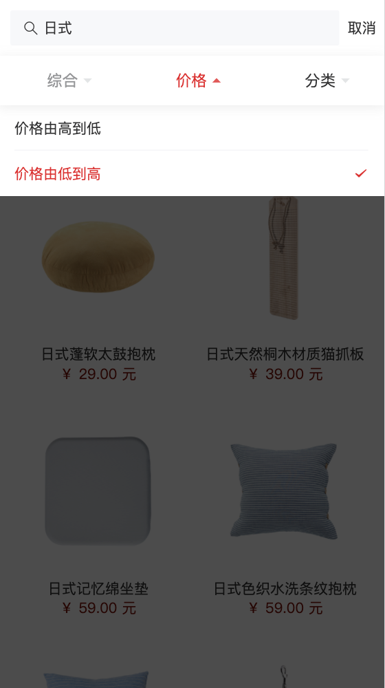
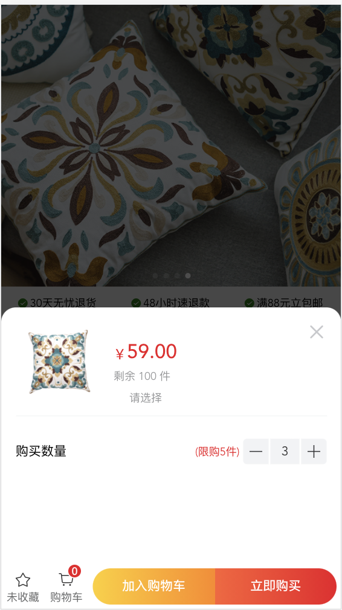
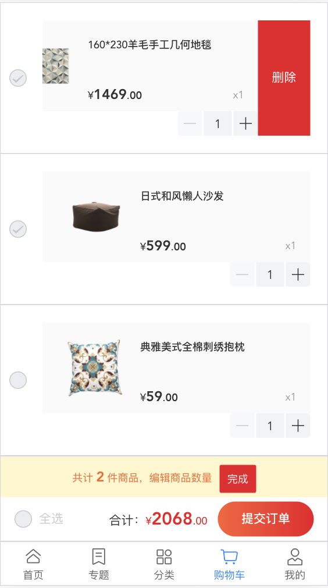

# vue_shopping

### Project setup
```
npm install
```

### Compiles and hot-reloads for development
```
npm run serve
```

### App running at
```
http://localhost:3000
```
### Login
test测试账户：

userName：默认用户

password：111111



---
### Search and Sort


---
### Detail


---
### Add to Cart


---

### Edit Cart
