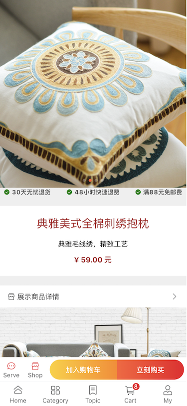
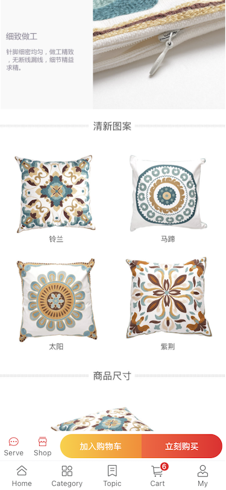

## Vite-Vue3-Mobile-Shopping
SPA Mobile EC shopping web application.


### Tech Stacks
- **Vite2**
- **Vue3**
- Vuex4
- Vue-Router4
- **Vant3** ( UI Components )
- Less
- postcss
- amfe-flexible
- Axios


### Directory Detail
```js
|- api
    |- home
    |- popup
    |- categary
    |- detail
    |- cart
    |- user
    ...
|- components
    |- Cards
    |- Empty
    |- Menu
    |- Form
    |- Nav
    |- Tabbar
    |- Tips
    |- Swiper
    ...
|- hooks
    |- useHomeListDetail.js
    |- usePopupKeywords.js
    |- usePopupResult.js  
    |- useGoodDetail.js
    |- useGrid.js
    ...
|- utils
    |- request.js // network request
    |- filters
        ...
    |- handleUserGridItems
        ...
    |- loading
    |- navagation gard
    ...
|- store 
    |- index.js // vuex
|- views
    |- Home
    |- Popup // search popup
    |- Category
    |- Topics
    |- Detail
    |- Cart
    |- User
    |- UserGrid
        |- UserInfo
        |- Orders
        |- Coupons
        |- Location
    ...
|- App.vue
|- main.js
...
```


### Images

#### 1. Home
1.1 home 


1.2 home


---

#### 2. Search

2.1 search history keywords


2.2 search result list


---

#### 3. Detail
3.1 detail




3.2 detail




3.3 detail popup sku 


---

#### 4. Category

---

#### 5. Cart

5.1 cart route navagation guard


---

#### 6. User

6.1 user login popup


